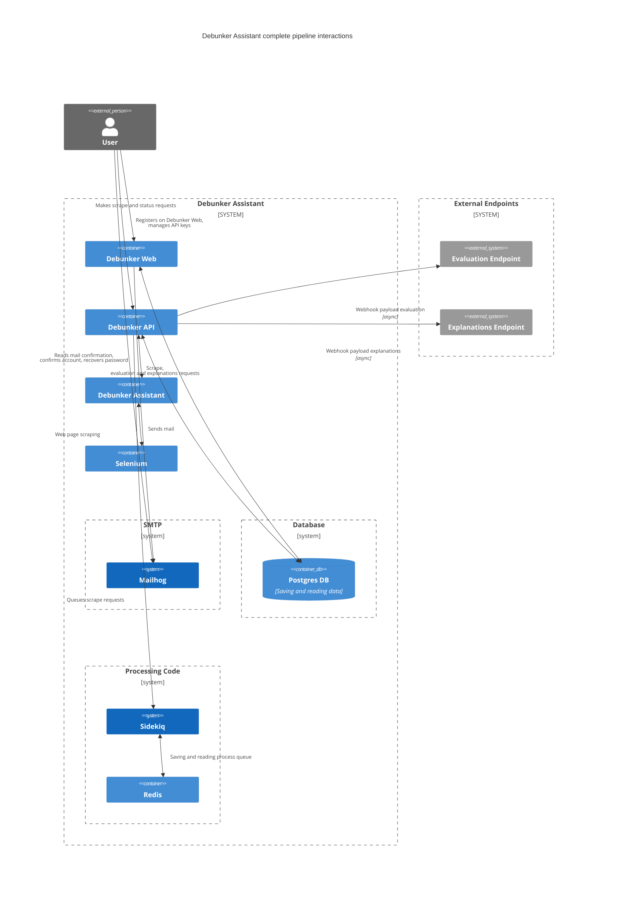

# DEBUNKER ASSISTANT - Complete pipeline

This repository was created with the aim of providing the complete pipeline for the _**Debunker Assistant**_ service [https://github.com/aequa-tech/debunker-assistant](https://github.com/aequa-tech/debunker-assistant) to enable simple and fast execution.

**Features**
- Debunker Assistant [https://github.com/aequa-tech/debunker-assistant](https://github.com/aequa-tech/debunker-assistant)
- Debunker Api [https://github.com/aequa-tech/debunker-api](https://github.com/aequa-tech/debunker-api)
- Debunker Web [https://github.com/aequa-tech/debunker-web](https://github.com/aequa-tech/debunker-web)

- Integrated SMTP service (Dockerized Mailhog)

**Customization**
The generic configuration is present in the `docker-compose.yml` file.
If you wish to customize environment variables, you need to start by modifying this file.
It is also possible to customize the environment variables of _Debunker Api_ and _Debunker Web_ by editing the `.docker.env` file in their respective project folders.

**Starting the project**
The _Debunker Assistant_, _Debunker Api_, and _Debunker Web_ services are integrated via git submodules.
Therefore, execute the checkout through
`git submodule update`

Once the checkout is done, the entire pipeline can be started with
`docker compose up --build` / `docker compose up`

## Service Usage and Accessibility
- Debunker Web > `localhost:3000`
- Debunker Api > `localhost:3001`
- Mailhog > `localhost:8025`

For a more complete description of the _Debunker Web_ and _Debunker Api_ services, refer to the documentation of the individual projects in the README of [https://github.com/aequa-tech/debunker-web](https://github.com/aequa-tech/debunker-web) and [https://github.com/aequa-tech/debunker-api](https://github.com/aequa-tech/debunker-api).

In this case, the single project is designed to be started with the `production` environment.
If you want to start it in development mode, the `RAILS_ENV` variable is present in the `environment` sections of the services in the `docker-compose.yml` file.

### Diagram to explain the interactions between the various components of the Debunker Assistant pipeline

## Contributing
_insert text_

## License
_insert text_

## Contact
_insert text_
